### UI/UX Plan — Education Platform (React)

This document defines the final UI/UX for the platform, optimized for clarity, speed, and accessibility. It aligns with the codebase (React/Next.js App Router, Tailwind) while staying framework-agnostic at the design layer.

---

## Principles
- Clarity over density: prioritize scannability and essential actions.
- Progressive disclosure: keep primary tasks prominent; hide complexity until needed.
- Fast feedback: optimistic interactions, inline validation, skeletons over spinners.
- Accessible by default: WCAG 2.1 AA, keyboard-first, screen-reader friendly.
- Role-focused: surface what matters most to each role on their home.

---

## Information Architecture (IA) & Navigation

- Global shell
  - Top bar: product name/logo, search (future), notifications, user menu.
  - Left nav (desktop): role-scoped primary navigation; collapsible.
  - Mobile: hamburger menu with the same role nav; persistent bottom tabbar for student (optional).

- Role navigation (primary)
  - Student: Dashboard, My Courses, Assignments, Quizzes, Planner, Timeline, Profile, Messages, Notifications
  - Teacher: Dashboard, Courses, Lessons, Modules, Assignments, Quizzes, Enrollments, Grading, Analytics, Announcements, Messages, Settings
  - Parent: Dashboard, Children, Directory, Announcements, Messages
  - Admin: Dashboard, Users, Roles, Parent Links, System Health, Logs, Feature Flags, Reports

- Wayfinding
  - Page header with title, context breadcrumbs (Course > Lessons > Edit), and action toolbar.
  - Consistent page-level tabs for sub-areas (e.g., Course: Overview | Lessons | Assignments | Quizzes | Analytics).

Sitemap (high-level)

```mermaid
graph TD
  A[Auth/Login] --> B[Student]
  A --> C[Teacher]
  A --> D[Parent]
  A --> E[Admin]

  B --> B1[Dashboard]
  B --> B2[My Courses]
  B --> B3[Assignments]
  B --> B4[Quizzes]
  B --> B5[Planner]
  B --> B6[Timeline]
  B --> B7[Profile]
  B --> B8[Messages]
  B --> B9[Notifications]

  C --> C1[Dashboard]
  C --> C2[Courses]
  C2 --> C2a[Lessons]
  C2 --> C2b[Modules]
  C2 --> C2c[Assignments]
  C2 --> C2d[Quizzes]
  C --> C3[Enrollments]
  C --> C4[Grading]
  C --> C5[Analytics]
  C --> C6[Announcements]
  C --> C7[Messages]
  C --> C8[Settings]

  D --> D1[Dashboard]
  D --> D2[Children]
  D --> D3[Directory]
  D --> D4[Announcements]
  D --> D5[Messages]

  E --> E1[Dashboard]
  E --> E2[Users]
  E --> E3[Roles]
  E --> E4[Parent Links]
  E --> E5[System Health]
  E --> E6[Logs]
  E --> E7[Feature Flags]
  E --> E8[Reports]
```

---

## Design System

- Tokens
  - Color: primary, success, warning, danger, neutral scale (50–900); dark-mode equivalents.
  - Typography: Inter/var; sizes xs–2xl; leading/snug/normal/relaxed.
  - Spacing: 0–10 (Tailwind scale); radii sm/md/lg; shadows sm/md/lg.
  - Z-index: overlay, modal, popover, toast, tooltip.

- Layout & Grid
  - Content max-widths: 768px (forms), 1280px (tables), fluid for dashboards.
  - Breakpoints: sm 640, md 768, lg 1024, xl 1280, 2xl 1536.
  - Responsive columns: 1/2/3/4 with gap-4; cards wrap.

- Component library (examples)
  - Atoms: Button, IconButton, Link, Badge, Tag, Tooltip, Spinner, Avatar.
  - Inputs: TextField, TextArea, NumberField, Select, Combobox, Checkbox, Radio, Switch, DatePicker, FileDropzone.
  - Feedback: Toast, InlineAlert, Banner, EmptyState, Skeleton.
  - Navigation: Breadcrumbs, Tabs, Stepper, Pagination, SidebarNav, TopNav, DropdownMenu.
  - Containers: Card, Panel, Modal, Drawer, SplitPane, Toolbar.
  - Data: DataTable (sorting/filtering/pagination), DefinitionList, KeyValueGrid, StatTiles, Chart primitives.
  - Composition: FormField wrapper (label, hint, error), FormGrid, ResponsiveGrid.

Patterns
- Forms: Zod validation, inline errors near fields, submit-level alerts, optimistic save where possible, autosave for editors.
- Tables: sticky header, column visibility, row selection (teacher/admin), batch actions, CSV export.
- Cards: used for overviews (courses, lessons) with key metrics; click-through to detail.
- Modals/Drawers: creation and quick edits; avoid nested modals.
- Search & Filters: query bar above tables (keywords, dropdown filters, date range).
- Toasters: short success/neutral messages; long errors inline.
- Wizards: multi-step for quiz builder; progress indicator; save draft.

Accessibility
- Keyboard: all controls reachable; focus outlines visible; ESC to close overlays.
- ARIA: roles for dialogs/menus/tabs; `aria-live` for toasts.
- Contrast: 4.5:1 minimum; test light/dark.

---

## Page Templates (by Role)

Student
- Dashboard: enrollments, due soon, unread notifications, quick links.
- Course > Overview: progress, next lesson, assignments, quizzes.
- Assignments: list (status, due date); detail with submit form (text/file).
- Quizzes: list; quiz runner (timer, autosave, navigation panel, results view).
- Planner/Timeline: per-course estimates; CSV export.

Teacher
- Dashboard: active courses, grading queue, recent activity.
- Course Admin: tabs for Overview | Lessons | Modules | Assignments | Quizzes | Enrollments | Analytics | Announcements.
  - Lessons: table + drag reorder; print/export.
  - Assignments: CRUD table; per-assignment submissions and grading.
  - Quizzes: builder (questions/choices), preview, publish; attempts list.
  - Analytics: lesson/engagement metrics with CSV.
  - Announcements: list/create; scheduled publish.
- Grading: unified queue; filters, quick grade panel.

Parent
- Dashboard: children summary (progress, recent grades, upcoming items).
- Children Directory: searchable; child detail with enrollments and announcements.
- Announcements: course-level feed relevant to linked children.

Admin
- Dashboard: health tiles, error rate, latency, uptime.
- Users/Roles: search, update role, impersonate (dev-only), bulk ops.
- Parent Links: CRUD; CSV export.
- System Health/Logs: recent structured logs, request-id drill-down; feature flags.
- Reports: usage, engagement; download CSV.

---

## Key Flows (UX Notes)

- Course creation
  1) Create course (title, optional description)
  2) Add lessons (inline or from lesson editor)
  3) Preview student view

- Assignment lifecycle
  - Teacher: create (title, due date, points); publish
  - Student: submit (text/file); see status
  - Teacher: grade (score + feedback); notify

- Quiz lifecycle
  - Build: add questions/choices; set time limit/points; preview
  - Run: timer, autosave answer; submit -> instant scoring; review

- Messaging
  - Inbox: thread list with unread count; thread view; composer; read receipts
  - Mention/attachments (future)

- Notifications
  - Bell menu: unread grouped by type; mark read/all; settings page (MVP later)

---

## Visualizations
- Stat tiles (KPI): total courses, lessons, submissions pending, attempts.
- Charts (MVP): bar/line for engagement over time; histogram (latency in labs for admin).

---

## Responsive & Performance
- Mobile: stacked layouts; primary actions in sticky footer or top toolbar.
- Skeletons for list/detail; defer heavy charts below the fold.
- Code-split feature areas; prefetch on visible links.

---

## Error/Empty/Loading States
- Empty: empathetic copy + clear next action (e.g., “Create your first lesson”).
- Error: inline with retry; include request id in dev; surface partial content when possible.
- Loading: skeletons for cards/tables/forms; avoid spinners longer than 400ms.

---

## Internationalization & Theming (Future-ready)
- i18n: all copy via message catalog; date/number formatting per locale.
- Theming: token-based dark mode; institution theming via CSS vars.

---

## Testing & Acceptance
- Unit: component library (buttons, inputs, data table), complex organisms (quiz runner, grading panel).
- E2E: core flows per role; accessibility checks (axe) on key pages; visual snapshots for critical screens.

---

## Implementation Notes (React)
- Structure
  - `components/ui/*` (tokens/atoms), `components/patterns/*` (molecules/organisms), `components/layout/*` (shell, navigation), `features/*` (domain UIs).
  - Form state: React Hook Form + Zod resolver; controlled inputs with accessible labels.
  - Tables: headless table with Tailwind styling; column configs per feature.
- State & Data
  - Server components for data fetch; client components for interactivity.
  - Suspense + skeletons; optimistic UI for light updates.

---

## Execution Plan (Frontend Parity)

P1 — App Shell & Components (Gateway-first)
- Add shadcn/ui; define tokens; ship Button, Input, Select, Dialog, Tabs, Card, DataTable, Toast.
- Implement role-aware layout in `components/layout/*` and `src/app/layout.tsx`.
- Introduce a small data gateway layer (`apps/web/src/lib/data/*`) with two backends: SupabaseGateway (real) and TestGateway (in-memory). UI consumes only the gateway interfaces so backend work can proceed independently.

P2 — Role Dashboards
- Student: upcoming assignments, per-course progress (derived from submissions vs assignments), recent grades.
- Teacher: my courses, grading queue (ungraded submissions), recent announcements.
- Parent: linked children overview (via `parent_links`), each child’s progress + announcements.

Sources: `GET /api/courses`, `GET /api/assignments?course_id`, `GET /api/submissions?assignment_id`, `GET /api/notifications`.
Gateway note: dashboards should use `CoursesGateway`, `AssignmentsGateway`, `SubmissionsGateway`, `NotificationsGateway` to remain backend-agnostic.

P3 — Profile & Settings
- Extend `profiles` with `display_name`, `avatar_url`, `bio`, `preferences jsonb` (migration).
- Thin wrapper APIs `GET/PUT /api/user/profile` for current user.
- Profile page (display name, bio, avatar upload), Settings (notification prefs MVP).
Gateway note: `ProfilesGateway` and `FilesGateway` with TestGateway fallbacks keep UI functional without storage.

P4 — Assignments & Grading Polish
- Student: assignment detail with status/submit/feedback.
- Teacher: unified grading queue table; inline score + feedback UI.
- File attachments via existing signed-URL pattern.

P5 — Analytics Light
- Stat tiles + charts for completion and average scores; CSV export buttons on tables.
- Implement via server components (direct queries) without new heavy endpoints; optionally emit `events` for future reports.
Gateway note: Reports can read from `ReportsGateway` which aggregates in-memory data in TestGateway.

P6 — Gamification UI Scaffold
- XP/level card, achievements grid, leaderboard list.

P7 — Real-time Feel (Polling)
- Poll `GET /api/notifications` every 15s; invalidate lists after submit/grade actions.

Acceptance (UI)
- Responsive layouts; keyboard and screen reader accessible; skeletons for loading; clear empty/error states.
- Storybook: develop components/flows against `TestGateway`; run a11y addon and optional visual diffs in CI.
